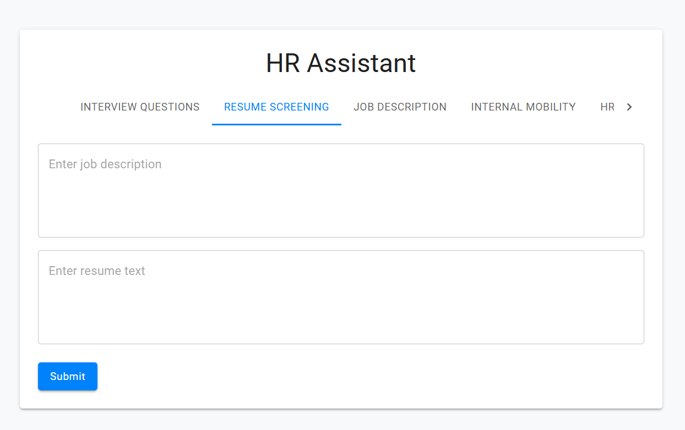

# HR Assistant Setup Guide

## Azure Steps

winget install -e --id Microsoft.AzureCLI

### `Login to Azure`

az login

### `Variables`

$RG_NAME="GenAI-BaseRG-southindia"
$LOCATION="southindia"
$OPENAI_NAME="GenAI-OpenAI-TheAI-nsteins"
$COGNITIVE_NAME="hr-cognitive"
$STORAGE_NAME="hrassistantstore"
$SEARCH_SERVICE_NAME="hr-assistant-search"

### `Create Resource Group`

az group create --name $RG_NAME --location $LOCATION

### `Create OpenAI Service`

az cognitiveservices account create `--name $OPENAI_NAME`
--resource-group $RG_NAME `--kind OpenAI`
--sku S0 `--location $LOCATION`
--yes

### `Create Storage Account`
az storage account create --name $STORAGE_NAME --resource-group $RG_NAME --location $LOCATION --sku Standard_LRS

### `Get storage connection string`
az storage account show-connection-string --name $STORAGE_NAME --resource-group $RG_NAME

### `Create Azure Search service`
az search service create --name $SEARCH_SERVICE_NAME --resource-group $RG_NAME --sku Standard --location $LOCATION

### `Get admin key`
az search admin-key show --resource-group $RG_NAME --service-name $SEARCH_SERVICE_NAME 
  

### `Create query key`
az search query-key create --resource-group $RG_NAME --service-name $SEARCH_SERVICE_NAME --name hr-assistant-query-key

### `Create search index`
$SEARCH_ENDPOINT="https://$SEARCH_SERVICE_NAME.search.windows.net"

curl -X PUT "$SEARCH_ENDPOINT/indexes/employee-profiles?api-version=2023-07-01-Preview" -H "Content-Type: application/json" -H "api-key: $SEARCH_ADMIN_KEY" -d "@index.json"

### `Create Cognitive Services`
az cognitiveservices account create --name $COGNITIVE_NAME --resource-group $RG_NAME --kind TextAnalytics --sku S0 --location $LOCATION --yes

## Test locally with Docker Desktop

### `Run this in PowerShell as Administrator first (one-time setup)`

Set-ExecutionPolicy RemoteSigned -Scope CurrentUser

### `Then run this in regular PowerShell`

.\build-local.ps1

## Deploy Container to Azure

.\deploy-azure.ps1

## Setup in Azure DevOps

### `Create New Pipeline`

Create new pipeline using azure-pipeline.yml

### `Add Azure service connection`

1. Azure Resource Manager service connection:

   - Name: Azure-Service-Connection
   - Subscription: Your Azure subscription
   - Resource Group: hr-assistant-rg

2. Azure Container Registry service connection:
   - Name: ACR-Service-Connection
   - Registry: hrassistantregistry.azurecr.io
   - Subscription: Your Azure subscription

### `Configure Pipeline Variables`

Configure pipeline variables:

- AZURE_SERVICE_CONNECTION: Name of your Azure Resource Manager service connection
- ACR_SERVICE_CONNECTION: Name of your Azure Container Registry service connection
- AZURE_OPENAI_ENDPOINT: (secret)
- AZURE_OPENAI_KEY: (secret)
- AZURE_COGNITIVE_ENDPOINT: (secret)
- AZURE_COGNITIVE_KEY: (secret)

### `Create Production Environment`

Create production environment

### `Run Pipeline`

Run pipeline
